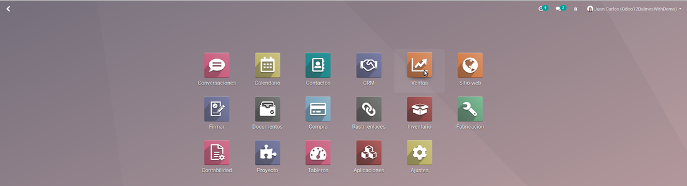
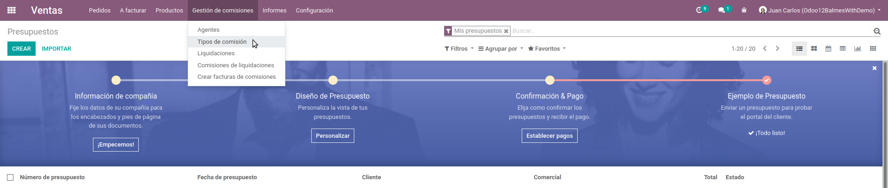
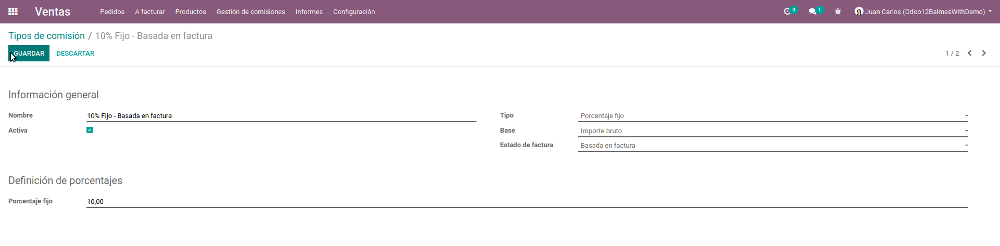
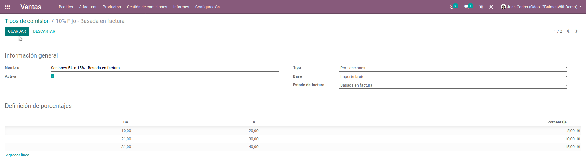

# Documentación de Comisiones
Antes de poder crear pedidos con comisiones, lo primero es crear y configurar las comisiones y los agentes.

## Comisiones
Ir a Ventas -> Gestión de comisiones -> Tipos de comisión -> Crear  
  
  

### Atributos
- Nombre: Este nombre aparecerá en la información del agente.
- Activa: Si es falso este "Tipo de comisión" no saldrá en las opciones del campo Comisión en la información del agente.
- Tipo:
    - Porcentaje fijo:  
        El porcentaje es fijo.  
          
    - Por secciones:  
        El porcentaje de la comisión se define por intervalos:  
        
- Base:  
    - Importe bruto:  
        El porcentaje se saca a partir del valor del pedido de venta o la factura.
    - Importe neto:  
        El porcentaje se saca solo a partir de la ganancia, deduciendo el costo del producto.
- Estado de factura:  
    - Basado en factura:  
        Las comisiones se liquidan cuando se emite la factura.
    - Basado en pagos:  
        Las comisiones se liquidan cuando se paga la factura.

## Agentes
Ir a Contactos -> Crear uno nuevo (Compañía) o seleccionar uno existente.